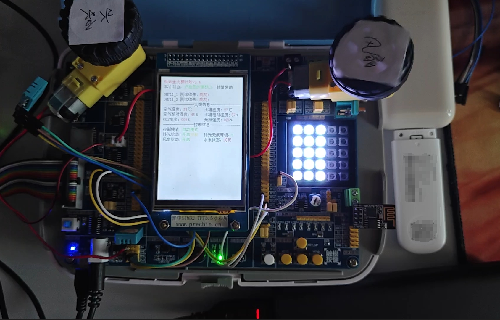

# 钛合金大棚计划

**这是一个课设项目，后续可能会随缘改进，基本功能差不多了**

基本长这样：

目前实现的功能：
- 环境监测
  - 空气温湿度
  - 土壤温湿度
  - 二氧化碳浓度（因为没买模块，用电位器代替）
- MQTT数据上报和远程控制
- 红外遥控
  - 使用C51小车套件里面的红外遥控，大概长这样（盗的图）
  - 

目前使用的模块有：
- esp8266
- DHT11（两个）
- 电机（两个）
- 4G网卡（很常见的中兴微R1869，去云控，用的自己卡，给esp8266上网用）

持续更新中......